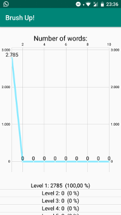

# Brush Up!
SQLite database of quiz questions.

This app allows you to brush up your language skills and put together those words that you are studying in a database. The user can create its own database, or load a default set of questions. It is a game to test your knowledge and put together all the vocabulary you need to brush up.

# Installation
Install the "BrushUp/app/release/app-release.apk" file on your Android device. The user will be asked to enable the installation of third-party apps.

    
